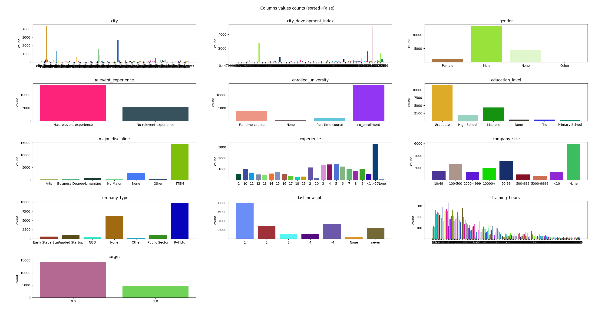
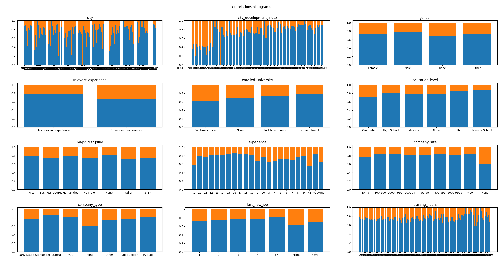
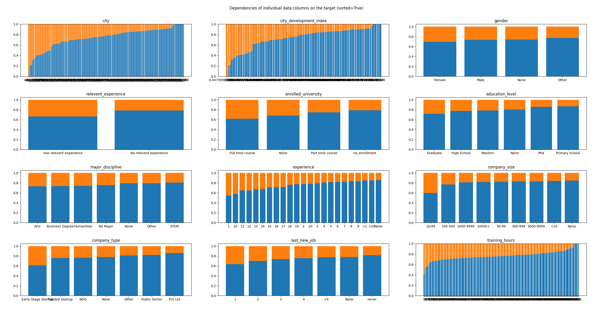
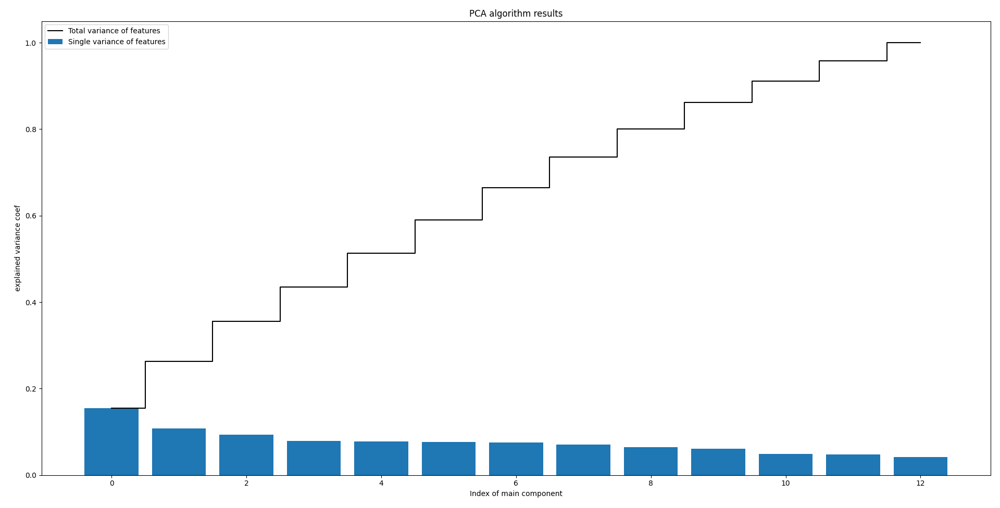

# HR Job Change Prediction
```AI Supervised learning from data```
```Created in July 2021```

---

### Description
- Program using Machine Learning based on most significant data features try to predict whether person will change the job or not
- As part of learning some different classification algorithms was used and compared (including deep neural network)

### Train and test data
- Data used to train and test describe values describe people - their gender, city, city development, education level etc.
- train data input shape (14368, 14)
- test data shape (4790, 14)
---

### Data details and dependencies
> As seen in the charts below, input data counts belong to each category is varies greatly and is not evenly distributed
> 

> As seen in the charts below, there are some potentially dependencies between a specific category and target. 
> This is clearly visible in the charts with titles "city", "city development index", "training hours", "experience".
> There are not visible dependencies between target and gender, major discipline, company size.
> 
> 

---

### Dimensionality reduction
To reduce data dimensionality from 14 to *n* (when n << 14) 3 algorithms was used:
* PCA
* Kernel PCA
* LDA

> Chart of **PCA** results shows that there are no one/two features that account for most of the information contained in the input data.
> 

> **KernelPCA** algorithm in scikit-learn doesn't contain attributes thanks to which would be possible to plot features importances.

> **LDA** dimensionality reduction could reduce input data into *min(unique_targets-1, features-1)*-dimensional space. In this case, this algorithm will not be of use.

---

### Classification
Classification was performed using several different algorithms. 
All the algorithms used were compared in several ways.

Algorithms used:
1. Decision Tree,
2. Random forest,
3. K-Nearest Neighbors (KNN),
4. C-Support Vector Classification (SVC),
5. Logistic Regression,
6. Team Classification,
7. Deep Neural Network.

---

## TODO ...
1. Using and comparing different classification algorithms,
2. Using team classification,   
3. Showing differences between ready estimators from sklearn package and
   tensorflow.keras deep neural network,
4. Summary
   * what has gone well/wrong,
   * what to change in the future programs, 
   * general thoughts

---

### Technology used
+ Python 3.9.5
    + scikit-learn
    + pandas
    + tensorflow
    + matplotlib
    + numpy

---

## License & copyright
© All rights reserved
