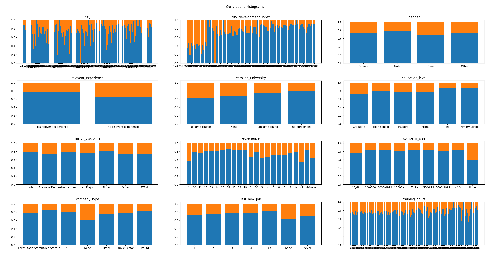

# HR Job Change Prediction
**AI Supervised learning from data**  
***Created in July 2021***

---

## Description
- Program using Machine Learning based on most significant data features try to predict whether person will change the job or not
- As part of learning some different classification algorithms was used and compared (including deep neural network)

## Train and test data
- Data used to train and test describe values describe people - their gender, city, city development, education level and other
- train data input shape (14368, 14)
- test data shape (4790, 14)
---

## Data details and dependencies
> As seen in the charts below, input data counts belong to each category is varies greatly and is not evenly distributed
> 

> As seen in the charts below, input data does not show any clear dependencies between a specific category and target. However, there could be a relationship between the city development index and the target 
> 

---
# TODO...

---

## Technology used
+ Python 3.9.5
+ scikit-learn
+ pandas
+ tensorflow
+ matplotlib
+ numpy

---

## License & copyright
© All rights reserved
