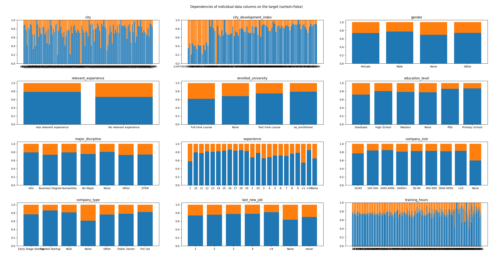

# Job Change Prediction
```AI Supervised learning from data```
```Created in July 2021```

---

### Description
- Program using Machine Learning based on most significant data features try to predict whether person will change the job or not
- As part of learning some different classification algorithms was used and compared (including deep neural network)

### Train and test data
- Data used to train and test describe values describe people - their gender, city, city development, education level etc.
- train data input shape (14368, 14)
- test data shape (4790, 14)
---

### Data details and dependencies
> As seen in the charts below, input data counts belong to each category is varies greatly and is not evenly distributed
> 

> As seen in the charts below, there are some potentially dependencies between a specific category and target. 
> This is clearly visible in the charts with titles "city", "city development index", "training hours", "experience".
> There are not visible dependencies between target and gender, major discipline, company size.
> 
> 

---

### Dimensionality reduction
To reduce data dimensionality from 14 to *n* (when n << 14) 3 algorithms was used:
* PCA
* Kernel PCA
* LDA

> Chart of **PCA** results shows that there are no one/two features that account for most of the information contained in the input data.
> 

> **KernelPCA** algorithm in scikit-learn doesn't contain attributes thanks to which would be possible to plot features importances.

> **LDA** dimensionality reduction could reduce input data into *min(unique_targets-1, features-1)*-dimensional space. 
> So on bars chart only 1 bar containing all the data information would be visible.

---

### Classification
Classification was performed using several different algorithms. 
All the algorithms used were compared in several ways
+ using ROC lines and AOC values,
+ test data prediction accuracy score,
+ test data prediction accuracy with and without dimensionality reduction.

Classification algorithms used:
1. Decision Tree,
2. Random forest,
3. K-Nearest Neighbors (KNN),
4. C-Support Vector Classification (SVC),
5. Logistic Regression,
6. Team Classification,
7. Deep Neural Network.

> During programming, PCA and LDA dimensionality reduction algorithms has been compared and 
> despite different features counts of PCA, LDA has given better results. 
> As the result LDA dimensionality reduction algorithm has been selected.
> 
> Algorithm Name      | Test Accuracy \[%] |
> --------------------|--------------------|
> Decision Tree       |        76.36      |
> Random forest       |        76.90      |
> K-Nearest Neighbors |        75.85      |
> C-Support Vector    |        76.34      |
> Logistic Regression |        76.37      |
> Team Classification |        76.37      |
> Deep Neural Network |        76.76      |
> 
> Every Classification algorithms reached common accuracy score (about 75/76%). 
> However, the best classifier (using only accuracy score) is Random Forest.
> 
> 
> **BUT**, looking at ROC lines it is visible that the best classifiers are Team Classification and (with a difference of 1 in ten thousand)
> Logistic Regression and Deep Neural Network.

---

### Confusion Matrices
> At the end the best classification algorithms confusion matrices have been created.
> 
> Deep Neural Network | SVM | Logistic Regression |
> --------------------|-----|---------------------|
>  |  |  |

---

### Summary and general thoughts

After programming, I think it was my first time when I deal with such demanding data. 
However, I learned such new things:
+ creating and analysis ROC lines and AOC values, 
+ creating and analysis confusion matrices, 
+ creating and using Pipelines in sklearn package,
+ casting string labels into given values using python map,
+ creating plots with multi data,
+ creating basic python documentation.

General thoughts:
1. In future programs, I'd like to focus even more on analyzing dependencies in the input data. 
2. I am most dissatisfied with the accuracy of prediction.
3. Generally I'm happy with the code and its documentation. 
4. I'd like to dive a lot deeper into the tensorflow library.

---

### Technology used
+ Python 3.9.5
    + scikit-learn
    + pandas
    + tensorflow
    + matplotlib
    + numpy

---

## License & copyright
© All rights reserved
